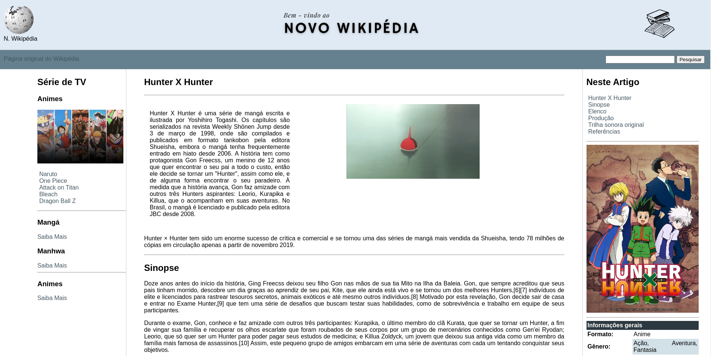

<h1 align="center">Novo Wikipédia</h1>

  
  

  <a href="#-projeto">Projeto</a>&nbsp;&nbsp;&nbsp;|&nbsp;&nbsp;&nbsp;
  <a href="#-objetivo">Objetivo</a>&nbsp;&nbsp;&nbsp;|&nbsp;&nbsp;&nbsp;
  <a href="#-desafio">Desafio</a>&nbsp;&nbsp;&nbsp;|&nbsp;&nbsp;&nbsp;
  <a href="#-links">Links</a>

  

## 🌱 Projeto
Módulo 3 - Trilha HTML
Título: Recriando Wikipedia, com um layout melhor :)

## 🎯 Objetivo
Este desafio consiste em treinar você com relação a estrutura do site, e também aplicar conhecimentos adiquiridos sobre semântica e acessibilidade.

## 🔄 Desafio
Neste repositório tem uma estrutura básica já pré-montada de um layout simples com um pouco de CSS aplicado. Apenas para deixar mais apresentável.

Fiquem a vontade para criar da forma que desejarem, e sobre os temas que quiserem. O intuito aqui é divertir, e ao mesmo tempo aprender com o desafio.

Sigam as intruções da chamada do vídeo. Acredito que por lá, ficará mais fácil de entenderem como proceder.

## 🔗 Links

- [New Wiki](https://leoviana00.github.io/dp-dio-wikipedia-layout-modern/)
- [Wikipedia](https://pt.wikipedia.org/wiki/Wikip%C3%A9dia:P%C3%A1gina_principal)
